# 1.	Introduction
This manual is the complete guide to constructing a Swarmie.  Construction is intended to be done in the order presented, but many portions are independent of each other.

Notes:
- All metric screws are colored black.
- All imperial screws are stainless steel, with the exception of two 2-56 nylon screw sizes.
- All holes in the 3D printed parts originally come filled with wax. Drilling these out should be effortless.  If it is not, you may have drilled too much or in an incorrect location.

**Warning:** Do not over-tighten screws in the 3D printed parts.  Tapping these parts is effective, but the threads are likely to be stripped if screws are over-tightened.

##Table of Contents
 - [Guide to 3D Printed and Laser-Cut Parts](./# Guide to 3D Printed and Laser-Cut Parts)
 - [3D Printed Parts](./Assembly1-2:Introduction.md/#3d-printed-parts)
 - [Laser-Cut Parts](./Assembly1-2:Introduction.md/#laser-cut-parts)

## Guide to 3D Printed and Laser-Cut Parts
### 3D Printed Parts

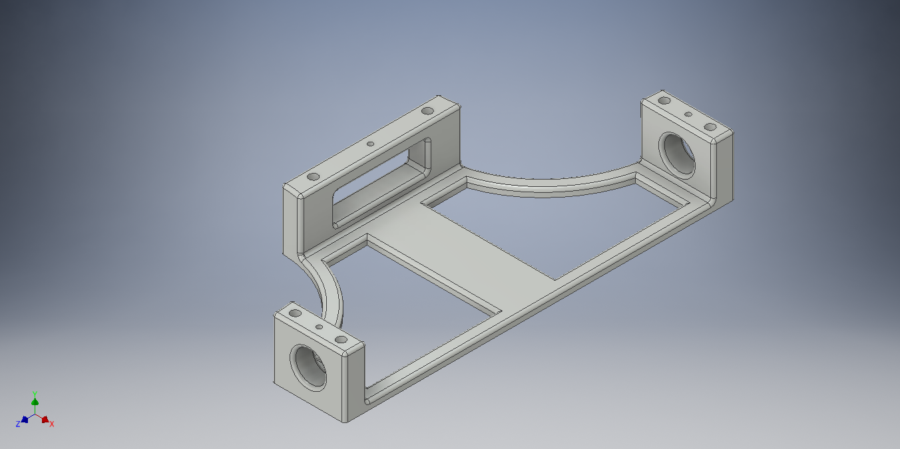
Figure 1: Battery Base

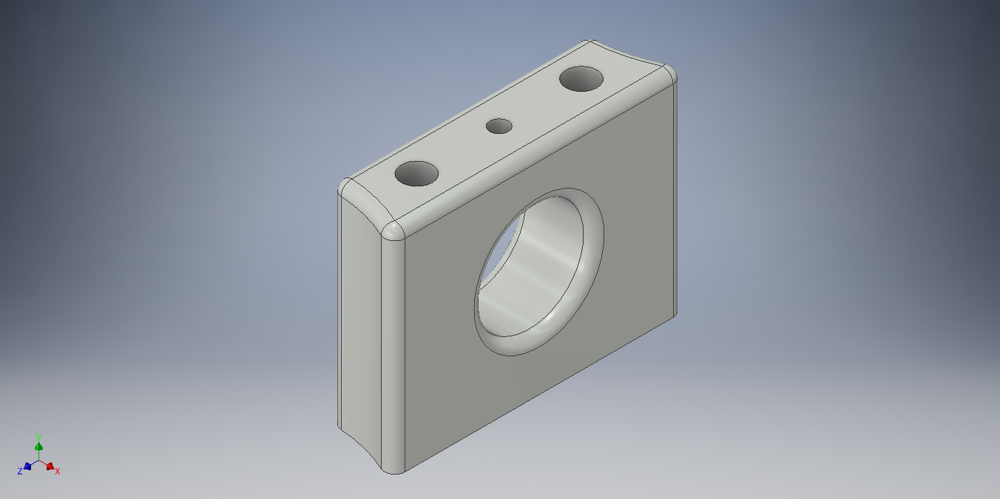
Figure 2: Battery Brace

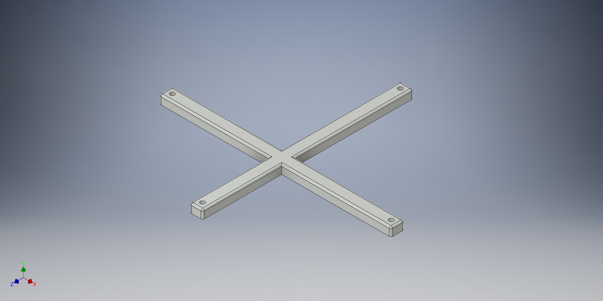
Figure 3: Battery Cross Strap

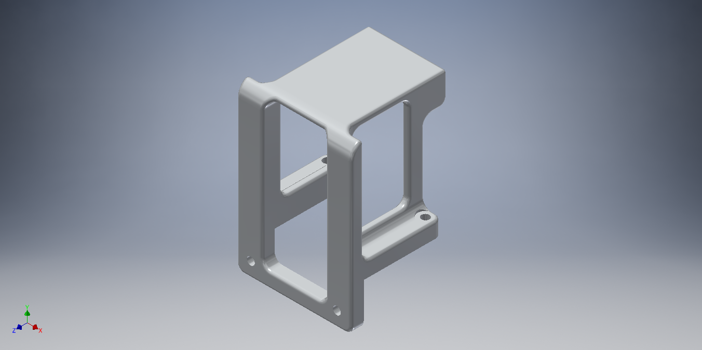
Figure 4: Camera Mount

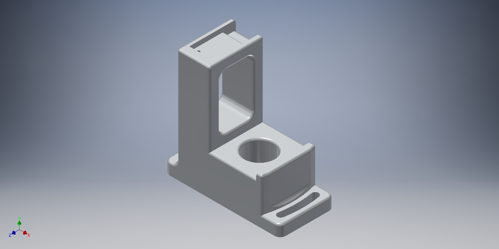
Figure 5: GPS/IMU Mount

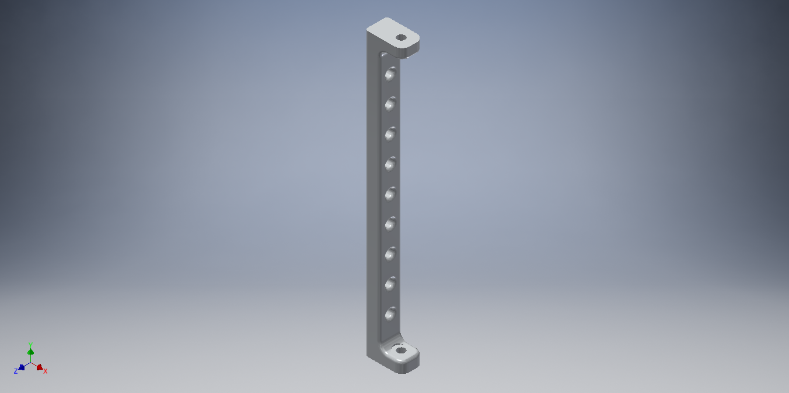
Figure 6: Lid Support

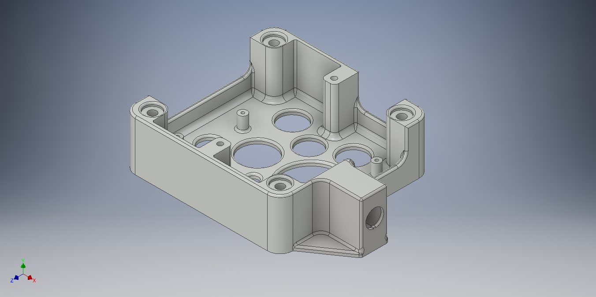
Figure 7: NUC Base

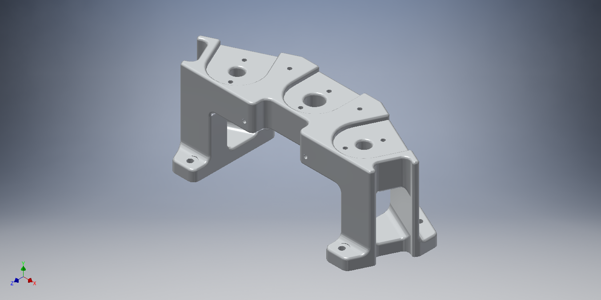
Figure 8: Ultrasound (US) Tower

###	Laser-Cut Parts

Each of the laser-cut parts comes covered in a brown protective film.  You can remove the film using a fingernail.
 
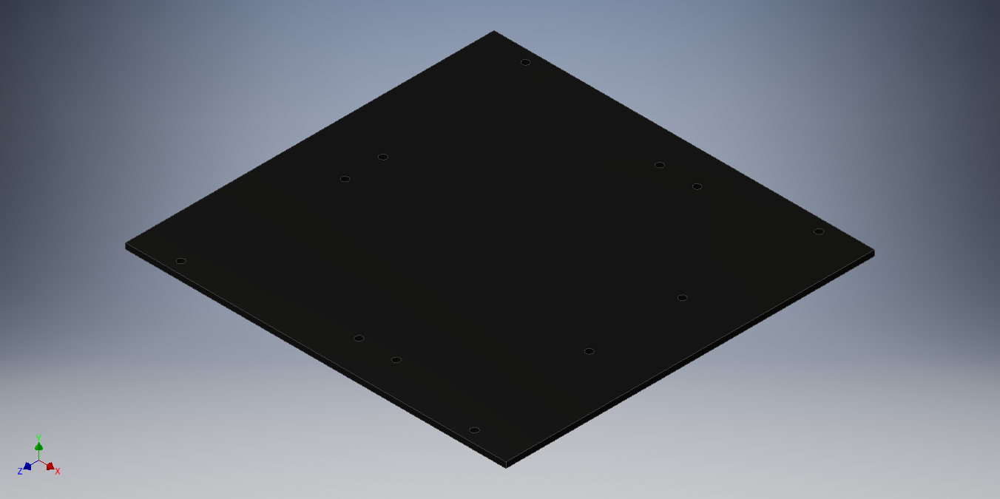
Figure 9: Bottom Plate

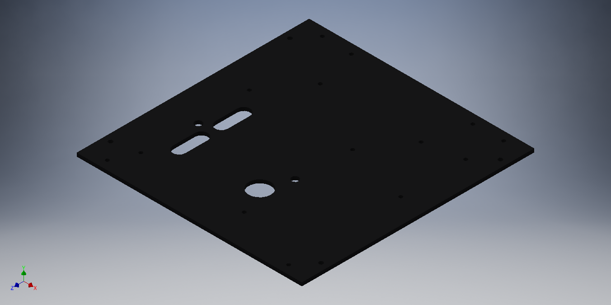
Figure 10: Top Plate

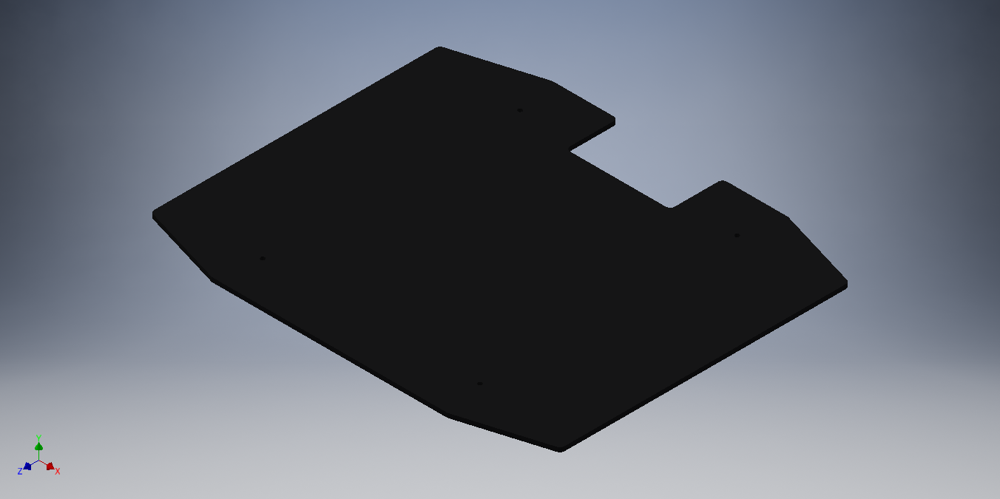
Figure 11: Cover Plate
