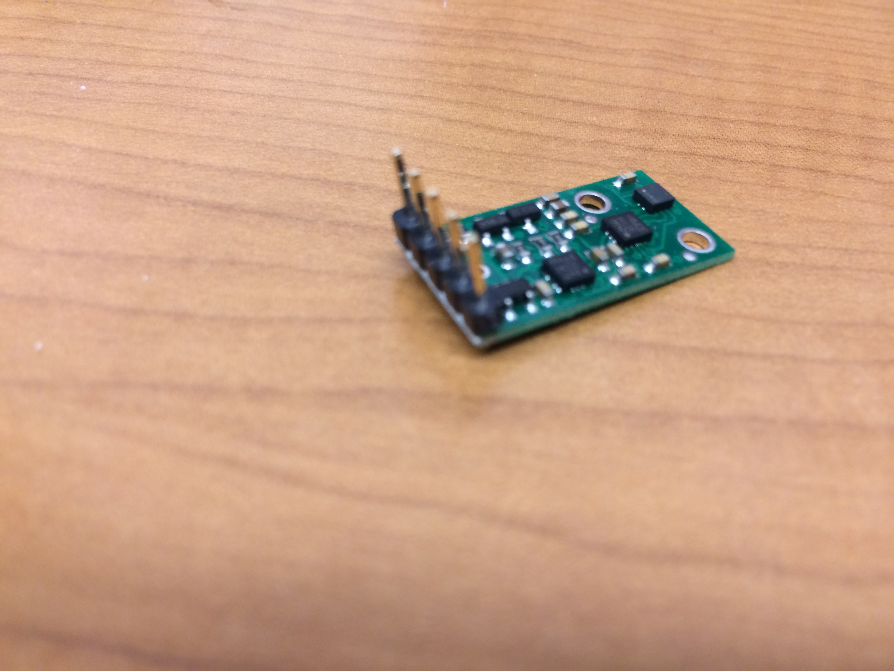

## 2.	Preparation – Drilling, Tapping, and Soldering

A few of the 3D printed parts have holes that need to be drilled and tapped.  These holes sometimes are filled with wax, but you can drill it out easily.  Tap lubricant should not be needed as the holes were all filled with wax at one point.

###Table of Contents
- [GPS/IMU Mount](./Assembly3:Preparation.md/#gpsimu-mount)		
- [NUC Base](./Assembly3:Preparation.md/#nuc-base)		
- [Battery Base and Battery Brace](./Assembly3:Preparation.md/#battery-base-and-battery-brace)

###	GPS/IMU Mount

Use a #50 drill bit to drill out the hole shown in the picture below.

 
Use a 2-56 tap to tap the hole.

Note: this hole will be used for securing the IMU using a 2-56x1/2” nylon screw.

###	NUC Base

Use a #50 drill bit to drill out the holes indicated in the picture below.  These holes should not be drilled all the way through.  The holes come filled with wax, so drilling into them should feel soft.  Once you feel some resistance, you have drilled through all of the wax, stop drilling.

Use a 2-56 tap to tap the holes.

###	Battery Base and Battery Brace

Use a #43 drill bit to drill out the four holes indicated in the pictures below.  The holes can be drilled through to the gap below them.
 

Use a 4-40 tap to tap the holes.

###	Ultrasound Tower

Use a #43 drill bit to drill out the 10 holes indicated in the picture below.  Warning: holes 1 and 2 are not through holes. You should be able see through the material to know how deep to drill.

 Use a 4-40 tap to tap the holes.  Note: because holes 1 and 2 are not through holes, you may need to partially tap them, remove and clean the tap, then finish tapping.  

### Solder IMU Headers

The IMUs come with two sets of headers, use only the straight set.  First, trim off one of the headers, only five are needed.  Solder the header onto the IMU as shown in the picture below.

