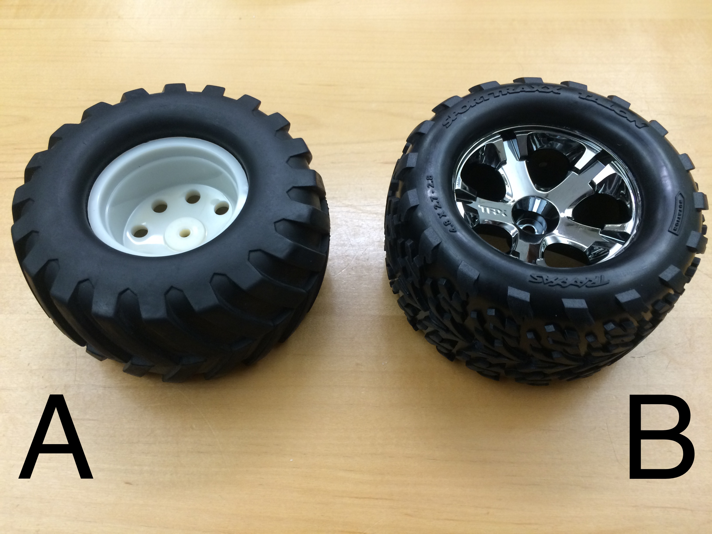

## 3. Chassis Assembly

###Table of Contents
- [Previous Section: Preparation](./Assembly2-Preparation.md)
- [Brackets](./Assembly3-ChassisAssembly.md/#brackets)
- [Motors](./Assembly3-ChassisAssembly.md/#motors)
- [Bottom Plate and Battery](./Assembly3-ChassisAssembly.md/#bottom-plate-and-battery)
- [Wheel Attachment](./Assembly3-ChassisAssembly.md/#wheel-attachment)
- [Next Section: Top Plate Assembly](./Assembly4-TopPlateAssembly.md)

###	Brackets

| Parts            | Tools                      |
| ---------------- |----------------------------|
| 8x M3x6mm Screws | Phillips Head Screw Driver |
|                  |                            |
| Chassis Kit      |                            |

Using eight M3x6mm screws, attach all four brackets together as seen in the following images.  Note that the two side brackets are not symmetrical and should be attached in the same orientation.  

**Note**: The M3x6mm screws used throughout the assembly are packaged with the chassis kit, not with the box of screws.

###	Motors

| Parts            | Tools         |
| ---------------- |---------------|
| 8x M3x4mm Screws | 2.0mm Hex Key |
|                  |               |
| 4x Motors        |               |

Attach motors to mounting holes using two M3x4mm screws per motor.  The motor shaft should be towards the bottom of the chassis.  See below for detail.

###	Bottom Plate and Battery

| Parts                  | Tools                       |
| ---------------------- |---------------------------- |
|	8x  4-40x1-5/8" Screws | 3/32" Hex Key               |
|	4x  4-40x1/2" Screws   | 1/16" Hex Key               |
|	4x  M3x6mm             | Phillips Head Screw Driver  |
|	8x  4-40 Nyloc Nuts    | ¼" Nut Driver               |
|	16x Washers            |                             |
|                        |                             |
|	Bottom Plate           |                             |
|	Battery Base           |                             |
|	Battery Brace          |                             |
|	Battery Cross Strap    |                             |
|	Battery                |                             |
|	Fire Retardant Bag     |                             |

**Note**: The M3x6mm screws used throughout the assembly are packaged with the chassis kit, not with the box of screws.

Remove the protective paper film from the bottom plate, if you have not already. 

Using eight 4-40x1-5/8" screws and nyloc nuts, attach the battery base and battery brace.  The top of the battery brace has rounded edges. Use washers on both sides of the screws.  Make sure the screw heads are on the bottom.  The nylon inserts in the nyloc nuts should always face away from the screw heads.

**Note**: The bottom of the chassis is the side in which the motor shafts are closest. 

Using four M3x6mm screws, attach the bottom plate to the bottom of the chassis. The plate can be attached in either orientation that it fits.  The orientation will matter later, when the wheels are attached.

Insert the battery into the fire retardant bag in the following orientation:
- The bag’s label facing you
- The bag's opening on the top
- The battery's wire leads coming out on the top right
- The battery’s label facing you  

Close the Velcro flap and wrap it around the back of the bag as tightly as possible.  This is necessary to properly fit into the battery base.  

Carefully lay the battery into the chassis to keep the bag tight. To maintain the tightness of the bag, insert it into the battery brace flap-side first, while holding onto the flap from underneath.

Then lower the other side to the battery base and press it in. The flap of the battery should be against the black acrylic of the bottom plate.

Next, use four 4-40x1/2” screws (button head) to screw the battery cross strap to the battery base and battery brace.  This strap fits only one way, line up the holes and be sure that the flat side is against the battery.

###	Wheel Attachment

If the wheels in your kit are white(A) and are not assembled with tires, follow the [Tire Assembly](./TireAssembly.md) guide. The newer Swarmie kits will come with black-chrome(B) wheels and fully assembled tires.

| Parts               | Fasteners       | Tools         |
| ------------------- | --------------- | ------------- |
|	2x Mounting Hub Kit |                 |               |
|                     | 4x Set Screws   | 3/32" Hex Key |
|                     | 4x Wheel Screws | 3.5mm Hex Key |
|                     |                 |               |
|	4x Assembled Tires  |                 |               |

Each mounting hub kit will contain two mounting hubs, two larger wheel screws, and three set screws. One set screw is extra.

Begin by screwing the wheel screws into the mounting hubs. Then slide the mounting hubs onto the motor shafts and screw on the set screw. The set screw has a hexagonal slot on one side to fit a 3/32" hex key, and should be screwed into the flat side of the motor shaft. 

**Note**: The wheel screws are screwed on first to ensure the mounting hub is attached at the correct distance from the motor.  

***Warning***: The set screws are apt to loosen as the Swarmie is driven, leading to the entire wheel coming off during use.  To avoid this, use [*Purple Locktite*](https://www.amazon.com/Loctite-38653-Purple-Strength-6-milliliter/dp/B0002KKTT0) to secure the set screw more permanently.

Unscrew the wheel screws, fit the wheel onto the mounting hub, and screw the wheel screw back in.  In the picture below you can see the direction in which the tires should be pointed.  The rear of the robot is considered to be the side of the larger battery base.

[Back to Top](./Assembly3-ChassisAssembly.md/#-3.-Chassis-Assembly)

[Next Section: Top Plate Assembly](./Assembly4-TopPlateAssembly.md)
