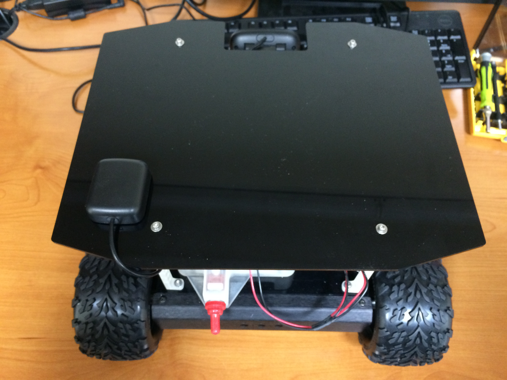

## 4. Top Plate Assembly

The Top Plate Fully Assembled

###Table of Contents
- [Previous Section: Chassis Assembly](./Assembly3:ChassisAssembly.md)
- [3D Printed Parts](./Assembly4:TopPlateAssembly.md/#3d-printed-parts)		      		
- [Ultrasound Sensor Mounting](./Assembly4:TopPlateAssembly.md/#ultrasound-sensor-mounting)				
- [Camera, IMU, GPS](./Assembly4:TopPlateAssembly.md/#camera-imu-gps)				
- [PCB, Switch, and Bus Connections](./Assembly4:TopPlateAssembly.md/#pcb-switch-and-bus-connections)				
- [NUC Assembly](./Assembly4:TopPlateAssembly.md/#nuc-assembly)		      		
- [Cover Plate Assembly and Attachment](./Assembly4:TopPlateAssembly.md/#cover-plate-assembly-and-attachment)		      		
- [Top Plate Attachment](./Assembly4:TopPlateAssembly.md/#top-plate-attachment)
- [Next Section: Fully Assembled](./Assembly5:FullyAssembled.md)

###	3D Printed Parts

Tools:
-	¼” nut driver
-	3/32” hex key

Parts:
-	Top plate
-	GPS/IMU mount
-	Ultrasound tower
-	6x 4-40x5/8” – 3/32” hex key
-	12x #4 washers
- 6x 4-40 nyloc nuts – ¼” nut driver

Attach the ultrasound tower using four 4-40x5/8” screws, eight washers (one on each side of each screw), and four nyloc nuts.

Attach the GPS/IMU mount using four 4-40x5/8” screws, eight washers (one on each side of each screw), and four nyloc nuts.

Attach the NUC base to the top plate using four 4-40x5/8” screws, four washers (one per screw on the bottom of the top plate), and four nyloc nuts.

###	Ultrasound Sensor Mounting

Tools:
-	Phillips head screw driver
-	1/16" hex key

Parts:
-	6x 4-40x1/2” button head screws – 1/16" hex key
- 3x ultrasound mount kits
-	3x ultrasound sensors

Remove the L-brackets from the ultrasound mount kits.  Drill out the indicated holes to fit a 4-40 screw.  A 1/8" drill bit was used for the holes pictured.

Screw the three L-brackets to the ultrasound mount using six 4-40x1/2" button head screws. Attach the two plastic spacers from the kit using two of the four Philips head machine screws.

Using the other two Philips head machine screws, screw the ultrasound sensors to the plastic spacers. Below is a picture of a finished ultrasound.

 
###	Camera, IMU, GPS

Tools:
-	Flat head screw driver
-	¼” nut driver

Parts:
-	4x 4-40x1/2” button head screws – 1/16" hex key
-	4x 4-40x5/8” screws – 3/32” hex key
-	4x #4 washers
- 4x 4-40 nyloc nuts – ¼” nut driver
-	1x 2-56x1/2” nylon screw - flat head screw driver
-	1x GPS
-	1x camera
-	1x IMU
-	Double sided foam tape

Attach the camera mount to the ultrasound tower using four 4-40x1/2” button head screws.

Use a strip of double sided foam tape to attach the GPS to the large, flat portion at the bottom of the GPS/IMU mount. Use the 2-56x1/2” nylon screw to attach the IMU to the top area on the GPS/IMU mount.

Use a strip of double sided foam tape to attach the camera to the top of the camera mount. At this point, the top plate should look like the picture below.

###	PCB, Switch, and Bus Connections

Tools:
-	Flat head screw driver

Parts:
-	PCB
-	Switch
-	Wiring harness
-	4x 2-56x3/8” nylon screws – flat head screw driver

Set the previously assembled top plate onto the robot and feed the battery cable through the hole in the NUC base. This will look like the image below.

Below is an image of the printed circuit board (PCB), used for connecting all of the Swarmie's electronics.  Place the PCB into the NUC base, in the orientation seen below.

Remove all of the nuts and washers from the switch. Feed the switch through the rectangular housing on the rear end of the NUC base, with the label pointing upwards. To get the switch through the housing hole, you may need to straighten the switch, as seen below.

Plug in the switch connector to the matching connector on the PCB labeled "S1," located next to the barrel jack socket, which is pointing towards the back of the Swarmie. Screw a single nut onto the switch to secure it in the housing. Then screw a red switch boot onto the switch.

Plug in the black micro USB cable into the A-Star Microcontroller, and plug the A-Star's pins into the PCB's matching header layout. The USB port on the A-Star should point towards the front of the robot. Plug the battery cable into the PCB barrel jack labeled "BATTERY 12V-19V." 

Lastly, plug the male-to-male barrel cable into the PCB's barrel jack labeled "NUC." 

The PCB should now look as pictured below.

 
Using four 2-56x3/8” nylon screws, screw the PCB onto the NUC base using the PCB holes labeled on the board as M1, M2, M3 and M4.   
Next, take the A* Microcontroller and plug it into the PCB with the micro-USB socket facing the front of the Swarmie.

Run the multicolored ribbon cable out of the NUC base and under the ultrasound tower.  Connect to the three ultrasound distance sensors, located on the front of the Swarmie, using the three 3-pin headers labeled as "L","C", and "R" with the label facing the front of the Swarmie.  

Connect the 4-pin header to the IMU with the label facing outward, as shown in the image below.  The VDD pin on the IMU is not connected to anything.

 
###	NUC Assembly

Tools:
-	Phillips head screw driver

Parts:
-	NUC
-	Wireless module
-	Solid state drive
-	2x RAM sticks

In this section, the wireless module, the solid state drive, and the RAM are installed in the NUC. Unscrew the bottom of the NUC. Unscrew the two screws circled in the image below.

Insert the wireless module into the indicated card edge connector, press it down, and fasten it using screw 2 from the image above. You will find a grey and black wire tucked in next to the chassis with gold colored snap-on leads. Plug these into the wireless card with the black wire closer to the chassis of the NUC.  

Next, insert the SSD into the indicated card edge connector and fasten it using screw 1.  Lastly, insert the two RAM sticks into their card edge connectors, on the right in the image above.  These snap in by pressing down.

The image above shows all parts installed.  The wireless module cannot be seen because it lies beneath the SSD.  Screw the bottom of the NUC back on.

The NUC is attached to the NUC base using two M3x18mm screws which are inserted from the bottom of the NUC base/top plate. The holes are circled in the image below. Use a 2.5mm hex key to fasten the screws. The side of the NUC with the single USB port needs to face the left side of the Swarmie.

!NUC Screw Hole](AssemblyImages/NUCScrewHole.jpg)

Plug the GPS and A* Microcontroller into the two adjacent USB ports on the right side of the Swarmie.  Wrap the GPS antenna’s cable, tie it together with a zip-tie, and store the excess cable behind the ultrasound tower.  Wrap the camera’s excess cable around the camera and camera mount, as seen in an image in section 6.3.  Plug the camera into the NUC on the left of the Swarmie.

###	Cover Plate Assembly and Attachment

Tools:
-	¼” nut driver
-	3/32” hex key

Parts:
-	Cover plate
-	4x lid supports
-	GPS Antenna
-	8x 4-40x5/8” screws – 3/32” hex key
-	16x #4 washers
-	8x 4-40 nyloc nuts – ¼” nut driver

Screw the lid supports to the cover plate using the screws listed above, a washer on each side of the screw, and nyloc nuts.  Make sure the screw heads are facing away from the lid supports.  Reference the image below:

Screw the GPS antenna to the GPS and set it aside.

Use the remaining screws, washers, and nuts to fasten the lid supports to the matching holes in the top plate on the Swarmie.  The cutout on the cover plate goes over the camera and the screw heads should face upwards.  

Use double sided foam tape to fasten the antenna to the rear-left side of the cover plate on the Swarmie.  It is important to position it here because the antenna has a strong magnet that may interfere with the compass.  Run the wire from the antenna through the camera cutout on the cover plate.  The following image shows the correct placement on top of the Swarmie.

### Top Plate Attachment

Tools:
-	2.0mm hex key

Parts:
-	4x M3x6mm - 2.0mm hex key

Feed the battery connector through the circular hole underneath the PCB. When ready to run the Swarmie, this will need to be plugged into the barrel jack labeled on the PCB as "BATTERY 12V-19V". This is the barrel jack closest to the front of the Swarmie.

Connect the two left motor connectors to the PCB via the two 6-pin headers through the (rear) oval hole underneath the PCB with the RED wire towards the back of the Swarmie.

Connect the two right motor connectors to the PCB via the two 6-pin headers through the (front) oval hole underneath the PCB with the RED wire towards the back of the Swarmie.

Use the following two images to connect the motors to the correct headers.

Finally, use four M3x6mm screws to fasten the top plate to the chassis. These are fastened through the four outer holes on the top plate which line up with the holes in the chassis.

[Back to Top](./Assembly4:TopPlateAssembly.md/#-4.-Top-Plate-Assembly)

[Next Section: Fully Assembled](./Assembly5:FullyAssembled.md)
