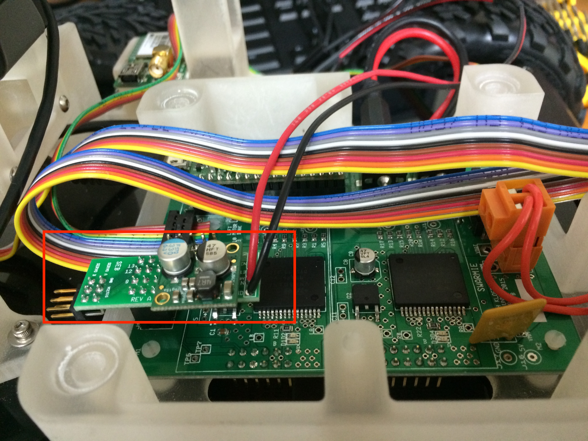
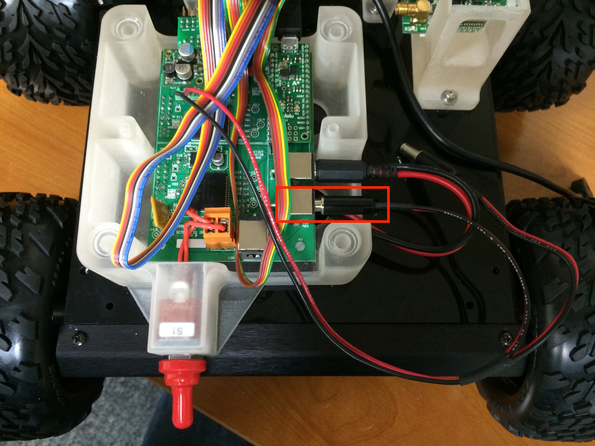

## 5. Gripper Assembly

[Previous Section: Chassis Assembly](./Assembly4-TopPlateAssembly.md)

[Next Section: Fully Assembled](./Assembly6-FullyAssembled.md)

| Parts                               | Tools                      |
| ----------------------------------- | -------------------------- |
|	Actobotics Standard Gripper Kit     | Phillips Head Screw Driver |
| Lynxmotion Pan and Tilt Bracket Kit | 1/16" Hex Key              |
|                                     |                            |
| 8x 2-56x5/8" Pan Head Screws        | Phillips Head Screw Driver |
| 8x 2-56 Nyloc Nuts                  | 1/4" Nut Driver            |
|                                     |                            |
| Gripper Fingers                     |                            |
| Gripper Wrist                       |                            |
| Servo Extension Board (SEB)         | 2.5mm Hex Key              |
**Note**: The SEB is only needed in this section for robots that were built last year.  Robots built this year have the SEB installed in the previous section of the assembly manual.

Remove the robot's front chassis plate by unscrewing its four M3x6mm screws.

![]

Attach the servo bracket to the robot's chassis bracket as pictured below.  Use four 2-56x5/8" screws and four 2-56 nyloc nuts.  The servo bracket is packaged with the Lynxmotion Pan and Tilt Bracket Kit.

![]
![]

Attach the gripper wrist plate and C bracket using four 2-56x5/8" screws and four 2-56 nyloc nuts.  The C bracket is packaged with the Lynxmotion Pan and Tilt Bracket Kit.

**Note**: Make sure that the C bracket is oriented correctly.  With the four screws towards yourself, the side of the C bracket with the single screw hole should be on the left.

![]
![]

In the bracket kit, you will find a small screw packaged with a plastic washer and an acorn nut.  Remove these three and use them to attach the C bracket to the servo bracket, as pictured below.

**Note**: The 1/4" nut driver does not quite fit the acorn nut, but it can be used to tighten the nut on the screw.  A pair of pliers will work as well.

**Note**: If the acorn nut is too tight, the wrist will have trouble rotating.  Lightly tighten down the acorn nut and then loosen it for a quarter turn.  The idea is to keep it loose enough to turn freely, and tight enough that the bracket does not wobble.

![]
![]

Place one of the servos in the servo bracket as pictured below.  Make sure to center the servo head if it isn't already.

![]

In the bracket kit you will find plastic snap rivets.  Use four of these to secure the servo to the servo bracket.

![]
![]

The bracket kit will also contain a sleeve of self-tapping screws.  Use two of these to fasten the white servo horn to the C bracket.

![]

Find the second servo motor and remove the horn attached to it.  Find the black or white horn, seen in the picture below, and attach it to the servo.  This servo horn is packaged with the Actobotics Standard Gripper Kit.

![]

Thread the second servo's ribbon cable through the C bracket.

![]

Discard the wrist plate and fingers that come with the Actobotics gripper kit.

This kit comes with four longer 6-32 screws and five shorter 6-32 screws.  Use four of the shorter screws to attach the second servo to the wrist plate.

![]

Reattach the robot's front chassis to the robot.

![]

Place \#6 washers between the finger and the wrist as well as between the screw head and wrist. Attach the fingers with the longer 6-32 screws and be sure to back off slightly after tightening so the fingers will turn, but not wobble.

![]
![]

Use one of the remaining shorter 6-32 screws and attach the two servo arms to the servo horn.

![]

In the Actobotics gripper kit, you will find a black plastic spacer.  Place the spacer under the top servo arm and attach that servo arm with the last longer screw. Attach the lower servo arm with the last short screw. Do not tighten too much so that the fingers can move effortlessly.

![]
![]

***
**Note**: If you have recently received your robot and already installed the SEB onto the PCB, you may skip the following section.  There is one last step to complete at the end of this page.

**Note**: If your robot is already built and are just following this build to assemble the gripper, you will need to remove the male-to-male barrel connector that connects the NUC to the PCB.
***

Now detach the top plate from the chassis.  Then, using a 2.5mm hex key, detach the NUC from the NUC base.

![]
![]

Plug the Servo Expansion Board (SEB) into the main PCB using the 6 six pins found towards the front of the PCB, left of the ribbon cable. The SEB's wires should be closer to the rear of the Swarmie.

Plug either of the male barrel jacks into the female barrel jack indicated below.

Reattach the NUC and the top plate.  Connect the second barrel jack, coming from the SEB, to the NUC's power plug.

![]

***
**Note**: This last step is necessary for all builds.
***

The servos' ribbon cables connect to the SEB with the yellow wire towards the left of the robot (towards the right in the image below).  The top cable should be connected to the fingers' servo and the bottom cable should be connected to the wrist's servo.

![]
