## 5. Gripper Assembly

[Previous Section: Chassis Assembly](./Assembly4-TopPlateAssembly.md)

[Next Section: Fully Assembled](./Assembly6-FullyAssembled.md)

| Parts                               | Tools                      |
| ----------------------------------- | -------------------------- |
|	Actobotics Standard Gripper Kit     | Phillips Head Screw Driver |
| Lynxmotion Pan and Tilt Bracket Kit | 1/16" Hex Key              |
|                                     |                            |
| 8x 2-56x1/2" Pan Head Screws        | Phillips Head Screw Driver |
| 8x 2-56 Nyloc Nuts                  | 1/4" Nut Driver            |
| 4x #6 Washers                       |                            |
|                                     |                            |
| Gripper Fingers                     |                            |
| Gripper Wrist                       |                            |
| Servo Extension Board (SEB)\*       | 2.5mm Hex Key              |
*The SEB is only needed in this section for robots that were built last year.  Robots built this year have the SEB installed in the previous section of the assembly manual.

***
**Note**: If you have recently received your robot and already installed the SEB onto the PCB, you may **skip this first section**.  
***

Remove the male-to-male barrel connector that connects the NUC to the PCB.

Next, detach the top plate from the chassis.  Then, using a 2.5mm hex key, detach the NUC from the NUC base.

Plug the Servo Expansion Board (SEB) into the main PCB using the 6 six pins found towards the front of the PCB, left of the ribbon cable. The SEB's wires should be closer to the rear of the Swarmie.

Plug either of the male barrel jacks into the female barrel jack indicated below.

Reattach the NUC and the top plate.  Connect the second barrel jack, coming from the SEB, to the NUC's power plug.

***
**Note**: The following is necessary for all builds.
***

Remove the robot's front chassis plate by unscrewing its four M3x6mm screws.

Attach the servo bracket to the robot's chassis bracket as pictured below.  Use four 2-56x1/2" screws and four 2-56 nyloc nuts.  The servo bracket is packaged with the Lynxmotion Pan and Tilt Bracket Kit.

Attach the gripper wrist plate and C bracket using four 2-56x1/2" screws and four 2-56 nyloc nuts.  The C bracket is packaged with the Lynxmotion Pan and Tilt Bracket Kit.

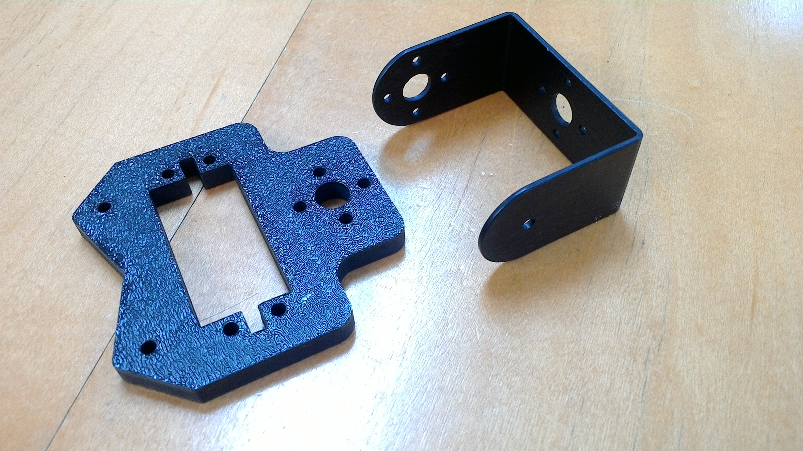

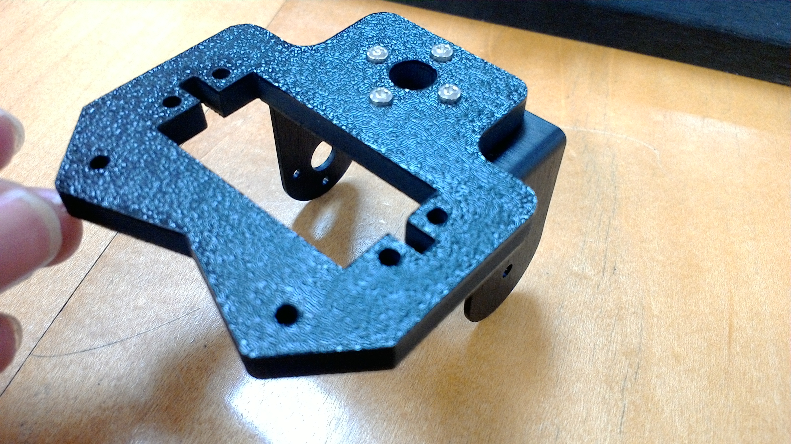

**Note**: Make sure that the C bracket is oriented correctly.  Look closely at the image above to make sure the holes are on the correct sides.

In the bracket kit, you will find a small screw packaged with a plastic washer and an acorn nut.

Use these three to attach the C bracket to the servo bracket, as pictured below.

**Note**: If the acorn nut is too tight, the wrist will have trouble rotating.  Lightly tighten down the acorn nut and then loosen it for a quarter turn.  The idea is to keep it loose enough to turn freely, and tight enough that the bracket does not wobble.

**Note**: The 1/4" nut driver pictured does not quite fit the acorn nut, but it can be used to tighten the nut on the screw.  A pair of pliers will work as well.

Place one of the servos in the servo bracket such that the circled holes are lined up.

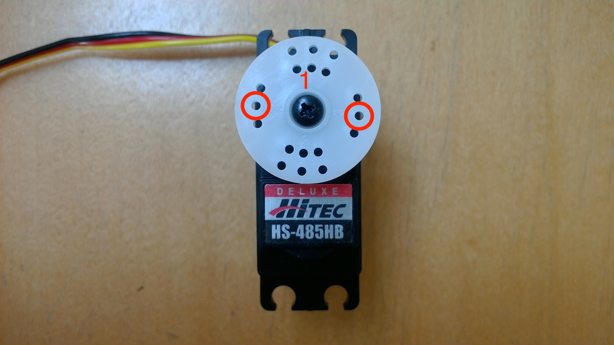

**Note**: You will notice that the servo horn is numbered 1-4 around its screw.  Be sure that the 1 is in the location indicated in the image above.

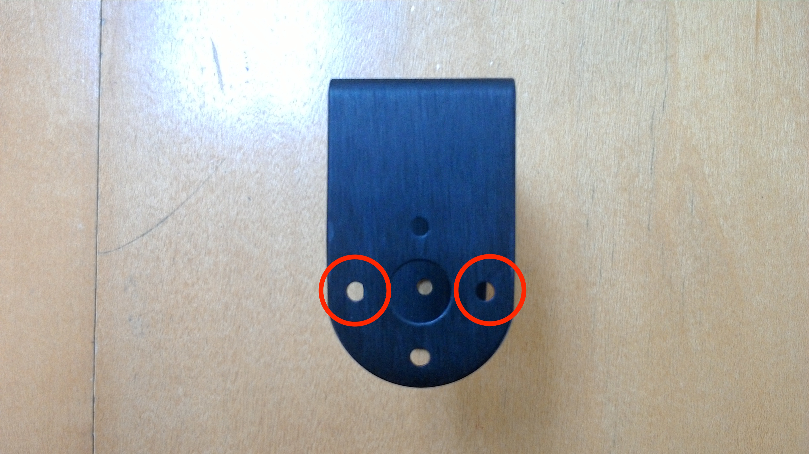

In the bracket kit you will find plastic snap rivets.  Use four of these to secure the servo to the servo bracket.

The bracket kit will also contain a sleeve of self-tapping screws.  Use two of these to fasten the white servo horn to the C bracket.  The third is a spare.

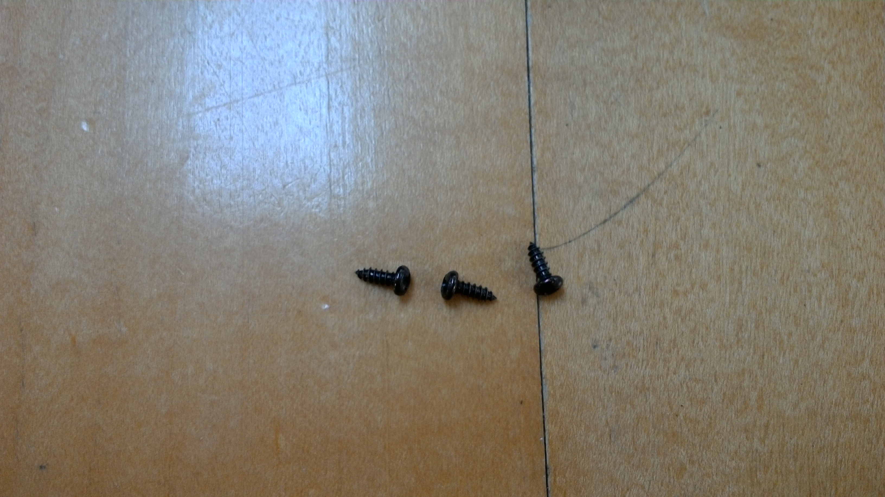

This kit comes with two long 6-32 screws, two middle length 6-32 screws, and five short 6-32 screws.  

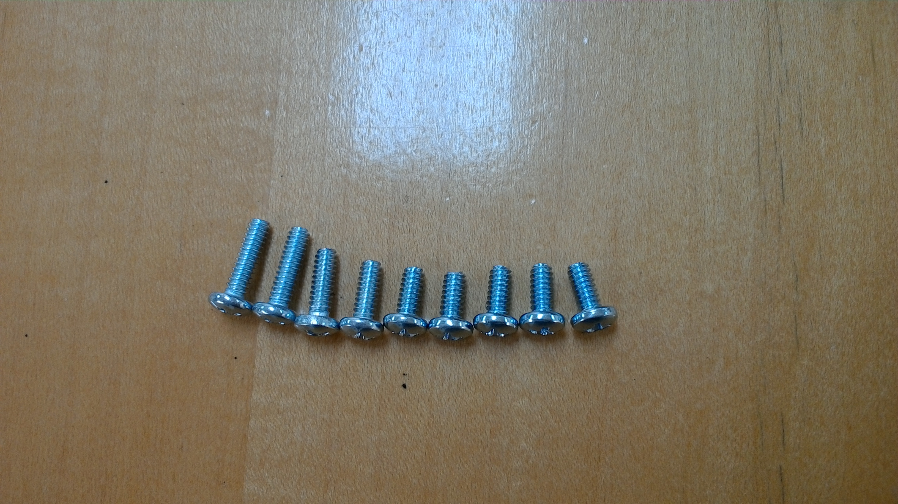

Use the four short screws to attach the second servo to the wrist plate.

Find the second servo motor and remove the horn attached to it.  Find the white teardrop-shaped horn.  This servo horn is packaged with the Actobotics Standard Gripper Kit.

**Note**: Do not use the black version, it does not fit the servo.

**Warning**: Lining up the teardrop servo horn is tricky and crucial to consistent gripping and keeping the servo from quickly burning out.  

Fully rotate the servo head counterclockwise.  Then attach the servo horn in the position seen below.

Lastly, reattach the washer and screw which held the original servo horn on.

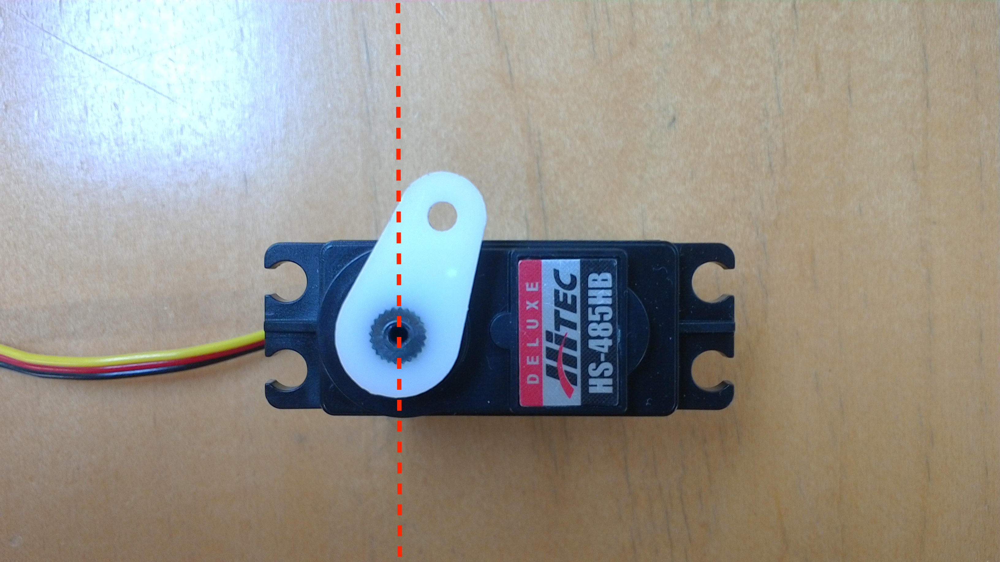

Thread the second servo's ribbon cable through the C bracket.

Reattach the robot's front chassis to the robot.

Place \#6 washers between the finger and the wrist as well as between the screw head and wrist. Attach the fingers with the two long 6-32 screws and be sure to back off slightly after tightening so the fingers will turn, but not wobble.

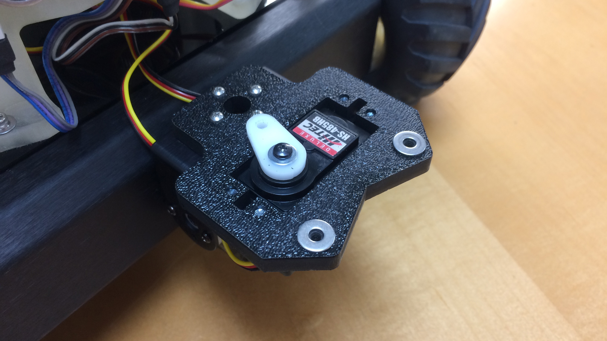

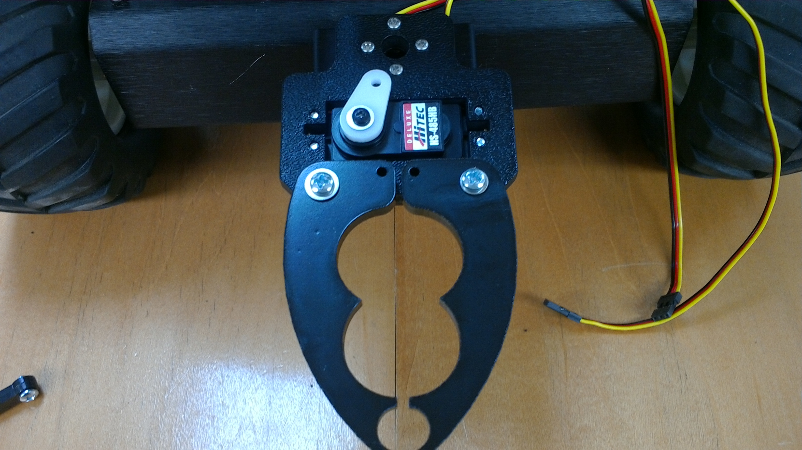

Use the remaining short 6-32 screw to attach the two servo arms to the servo horn.

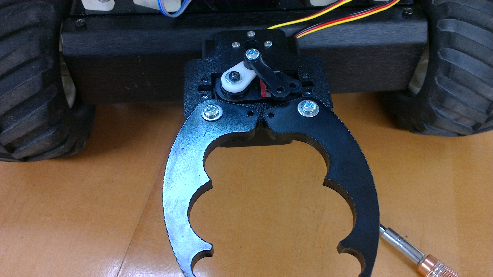

In the Actobotics gripper kit, you will find a black plastic spacer.  Place the spacer under the top servo arm.  

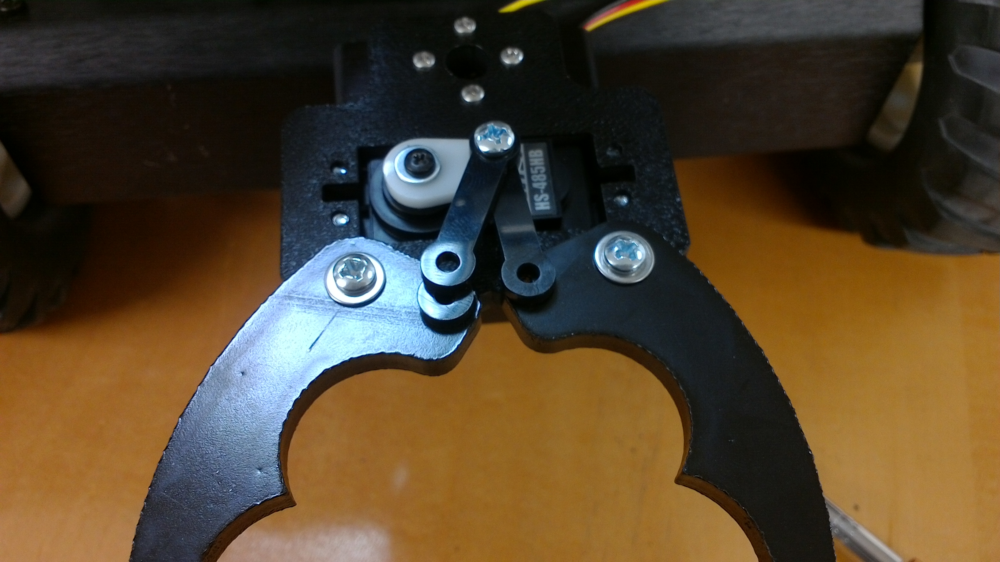

Attach the servo arms to the fingers using the medium length screws.  Do not tighten too much so that the fingers can move effortlessly.  

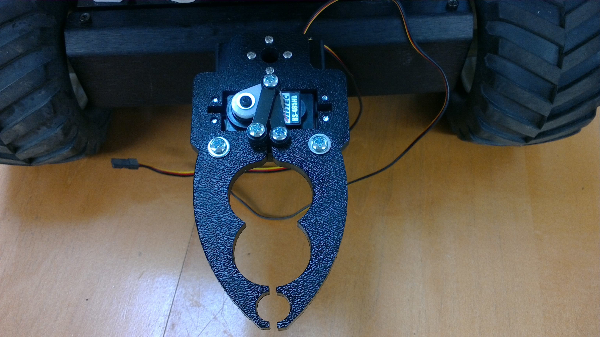

The servos' ribbon cables connect to the SEB with the yellow wire towards the left of the robot (towards the right in the image below).  The top cable should be connected to the wrist's servo and the bottom cable should be connected to the fingers' servo.

***

When running Swarmathon-ROS the fingers and wrist should be in default positions that look like the images below.

**Note**: Make sure the fingers are not touching or are not spaced apart further than you see above.

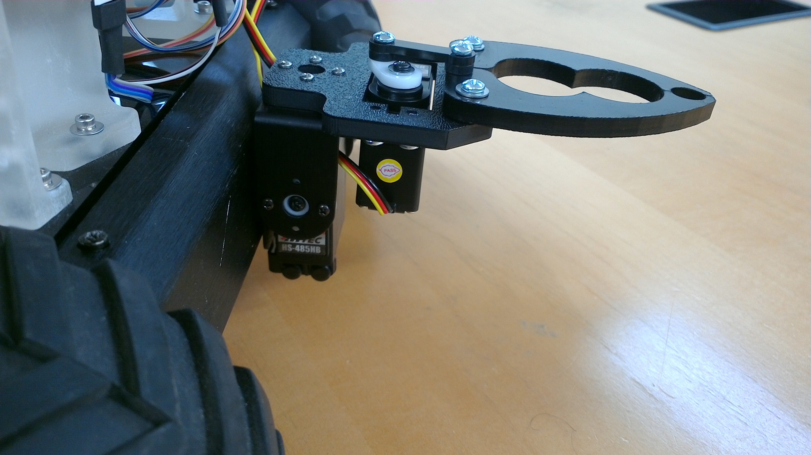

[Back to Top](./Assembly4-TopPlateAssembly.md/#-5.-Gripper-Assembly)

[Next Section: Fully Assembled](./Assembly6-FullyAssembled.md)
