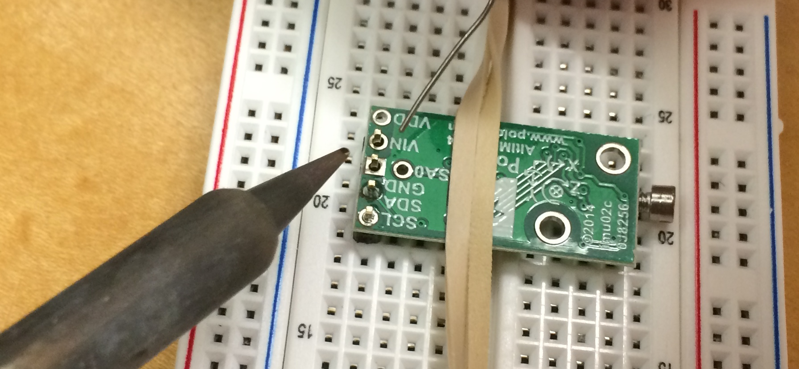
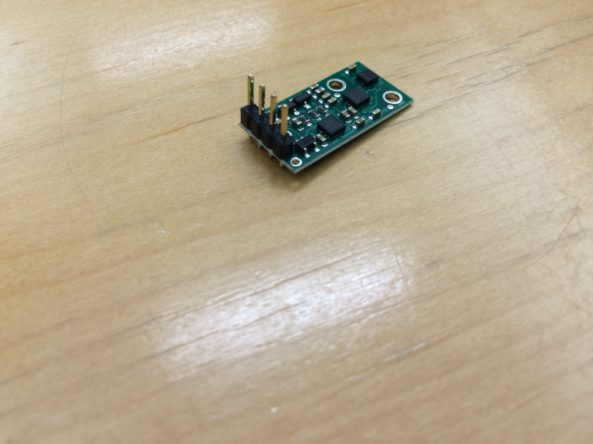

##IMU Preparation Guide

*This guide is for Swarmie kits with IMUs which are not pre-soldered.*

The IMUs come with two sets of headers, use only the straight set.  First, trim off two of the headers, only four are needed.  Solder the headers onto the *top four* pins, ie. SCL, SDA, GND, and VIN.  **The VDD pin is not used.**

It is helpful to put the IMU and headers into a breadboard to hold the pins and IMU straight. In the images below, a screw was also use to prop the IMU up.

