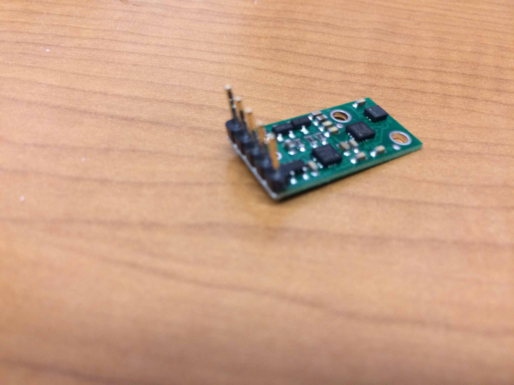

##IMU Preparation Guide

This guide is for Swarmie kits with IMUs which are not pre-soldered.

The IMUs come with two sets of headers, use only the straight set.  First, trim off one of the headers, only five are needed.  Solder the header onto the IMU as shown in the picture below.

