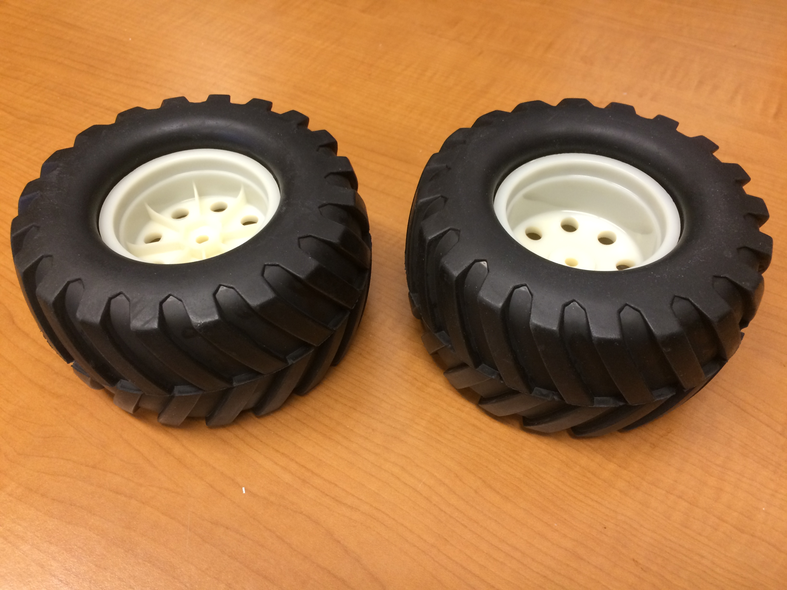
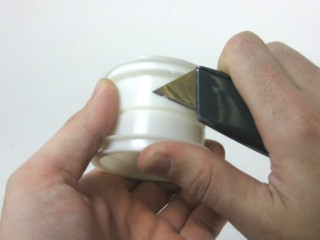
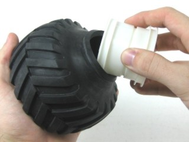
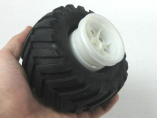
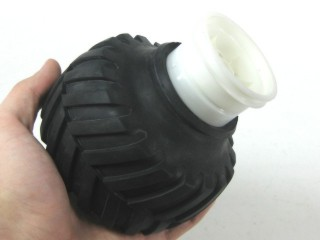
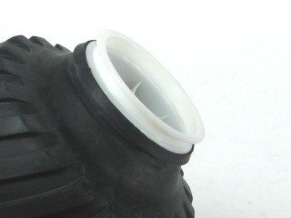
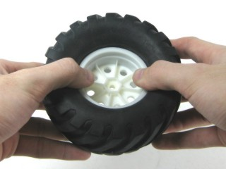
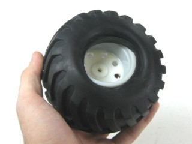
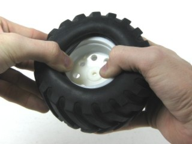
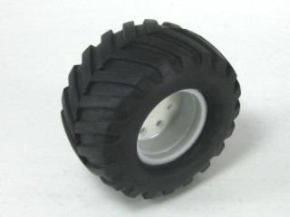

###	Tire Assembly

Wheel assembly instructions have been adapted from Lynxmotion’s instructions found [here](http://www.lynxmotion.com/images/html/build007.htm).

**Important:** half of the wheels must be assembled opposite to the other half.  This is to make sure that when they are attached to the Swarmie, they are all facing the same direction.  Example below:

 
Notice that the tread is pointed in the same direction, but the inner wheels are in opposite orientations.

1.	First use a utility knife, or similar, to carefully remove any imperfections on the inner part of the rim. This will make things much easier later on.

  

  Figure 1

2.	Pull one side of the tire out, so that it protrudes, like in the image. Insert one side of the rim. It helps to insert at an angle in the middle, where the opening is the largest. Rotate the rim slowly, while pressing it in, to help coax it into place.

  
  
  Figure 2

3.	You should end up with the tire and rim looking like Figure 14.

  
  
  Figure 3

4.	Pull out the side of the tire again, so that it looks like Figure 15.

  
  
  Figure 4

5.	Gently press and rotate the rim into the tire. You want to end up with the rim almost fully into the tire with the bead still sticking out, as in Figure 16. If there are any imperfections leftover from Step 1, then it may be difficult to pass the tire over them.

  
  
  Figure 5

6.	Quickly press the rim into the tire from both sides. The bead should now be completely in the flange. This step may require several attempts.

  
  
  Figure 6

7.	Flip the tire over. It should look something like Figure 18. 

  
  
  Figure 7

8.	Almost half the bead is in the flange. Just hold that side in and pull the rest of the bead away from the center, and it will retract back into the flange. It may be helpful to use a screw driver to pull the tire over the wheel.

  

  Figure 8

9.	A completed tire is shown in Figure 20.

  

  Figure 9
